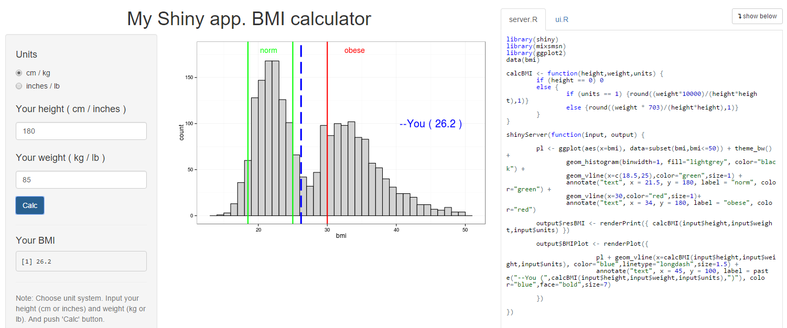

## Body mass index (BMI)

The body mass index (BMI) is defined as the body mass divided by the square of the body height, 
and is universally expressed in units of kg/m2, resulting from mass in kilograms and height in metres. 

<div style="font-size: 120%;">
$$BMI= \frac{weight_{kg}}{height_m^2 } = \frac{weight_{lb}}{height_{in}^2} * 703$$
</div>

BMI is employed among children and adults to predict health outcomes. Commonly accepted BMI ranges:  
 - underweight: under 18.5
 - normal weight: 18.5 to 25
 - overweight: 25 to 30
 - obese: over 30

--- 
## Data distribution

My application calculate BMI for data, entered by user and show resalt at plot.  
The application uses "mixsmsn" R package, which contains BMI data for 2107 people. 
This data reflect some sample distribution BMI values
``` {r,warning=FALSE,fig.height=3.5}
library(mixsmsn);library(ggplot2);data(bmi)
ggplot(aes(x=bmi),data=bmi) + theme_bw() + geom_histogram(binwidth=1,fill="grey",color="black")+ 
        geom_vline(x=c(18.5,25),color="green",size=1) + geom_vline(x=30,color="red",size=1) + 
        annotate("text", x=c(21.5,34), y=180, label=c("norm","obese"), color=c("green","red"))
```

---  

## Application

To calculate BMI, user should input weight and height data and push "Calc" button.

<div style='text-align: center;'>
    
</div>

---  

## Links

App link http://johnpateha.shinyapps.io/My_Shiny_App_BMI  

Github repo http://github.com/johnpateha/MyShinyAppBMI  

This presentation http://johnpateha.github.io/MySlidifypres

For more information about BMI see <a href="http://en.wikipedia.org/wiki/Body_mass_index">  WiKi </a>  

Information about <a href="http://cran.r-project.org/web/packages/mixsmsn/mixsmsn.pdf">  "mixsmsn"  </a> data package  

 
 

